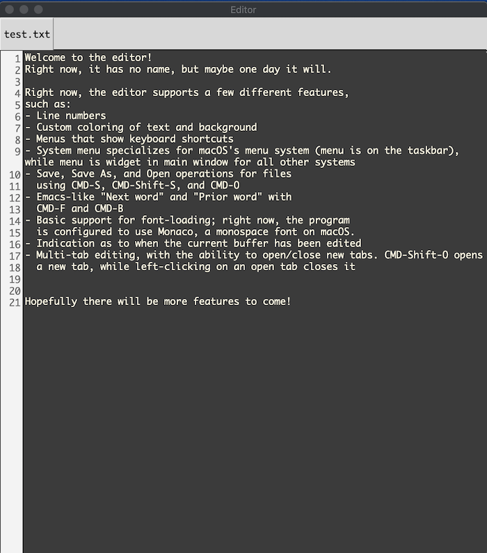

# Editor

This is a text editor built using FLTK GUI library and C++. It is heavily based on the default
FLTK text editor widget, `Fl_Text_Editor`, which in turn is based on the NEdit
editor. It is designed to be cross-platform, but so far I have only tested builds
on macOS.

The editor itself is pretty bare-bones. Here are some of the features (this list
can also be found in `test.txt`, the default file opened when the program starts):

- Line numbers
- Custom coloring of text and background
- Menus that show keyboard shortcuts
- Support for macOS's menu system (menu is on the taskbar instead of in-window)
- Save, Save As, and Open operations for files
  using CMD-S, CMD-Shift-S, and CMD-O
- Emacs-like "Next word" and "Prior word" with
  CMD-F and CMD-B
- Basic support for font-loading; right now, the program
  is configured to use Monaco, a monospace font on macOS.
- Indication as to when the current buffer has been edited

## Building

To build and install the app, you first must clone the repository, then
install the `fltk` git module.

Building the program should be as simple as running `make`. This will build the FLTK static library if necessary.

**Note:** `fltk` is included as a git submodule in this repo, not as a shared library in the standard system install location (e.g. `/usr/lib`). This makes it
simpler to install and reinstall the `fltk` submodule, and also reduces the chance
that the app will conflict with any other shared libraries/package managers.

I hope that you find this project interesting (and maybe useful)!